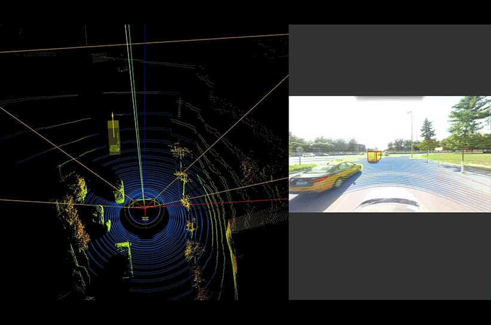

# Report

## 3D object Detection Techniques

- [Det3D](https://github.com/poodarchu/Det3D) : the first 3D Object Detection toolbox which provides off the box implementations of many 3D object detection algorithms

- **[Focus on]**[OpenPCDet](https://github.com/open-mmlab/OpenPCDet): OpenPCDet is a clear, simple, self-contained open source project for LiDAR-based 3D object detection.
    - [Installation] https://github.com/open-mmlab/OpenPCDet/blob/master/docs/INSTALL.md
    - [Usage] https://github.com/open-mmlab/OpenPCDet/blob/master/docs/GETTING_STARTED.md

## Test Dataset

### [`KITTI`](http://www.cvlibs.net/datasets/kitti/eval_object.php?obj_benchmark=3d)

1. Rading and visulization Tools

    1.1 Copy this code as following into your favorite text editor.

    <details>
    <summary>converter</summary>

    ``` python
    import struct
    import sys

    def convert_kitti_bin_to_pcd(ifile,ofile):
        size_float = 4
        list_points = []
        # read from ifile
        with open(ifile, "rb") as f:
            byte = f.read(size_float * 4)
            while byte:
                x, y, z, intensity = struct.unpack("ffff", byte)
                list_points.append([x, y, z])
                byte = f.read(size_float * 4)
        # write into ofile
        with open(ofile, 'w') as f:
            for points in list_points:
                for item in points:
                    f.write(str(item)+' ')
                f.write('\n')

    if __name__ == "__main__":
        if len(sys.argv) < 2: 
            print("please use: python converter.py [filename] like `python converter.py 000000.bin`\noutput file(*.txt) will be named after filename from input.")
            exit()
        bin_filename = sys.argv[1]
        txt_filename = bin_filename[:bin_filename.find('.')]+".txt"
        print("Reading:",bin_filename)
        print("Writing:",txt_filename)
        convert_kitti_bin_to_pcd(bin_filename,txt_filename)
        print("Finished")
    ```
    </details>

    execute converting by running `python converter_bin2txt.py 000000.bin `

    1.2 Download [CloudCompare](https://www.danielgm.net/cc) as a visualization tool.


## 3D Point Cloud Labeling Tools

There are many tools that can provide the function of marking and labeling a bunch of points.
However, most of them are not free or mainly constructed for **LiDAR** data.

- https://www.basicfinder.com/en (service, NOT FREE)
    

- https://supervise.ly/lidar-3d-cloud (online)
    

- https://github.com/Allchen/3D-Label-PointCloud (local installation)
    

- https://github.com/walzimmer/3d-bat (local installation)
    
